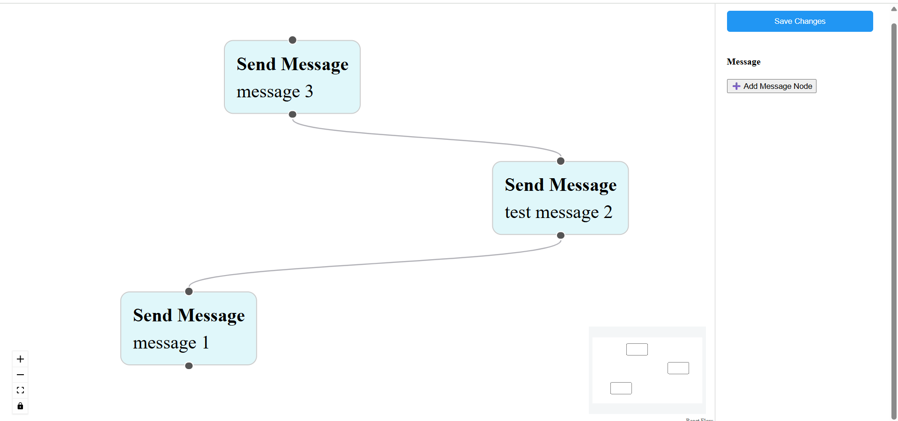

#  BiteSpeed Chatbot Flow Builder

Welcome to the **Chatbot Flow Builder**! This project lets you visually design chatbot message flows using an intuitive drag-and-drop interface, powered by **React** and **React Flow**.

> Created as part of the BiteSpeed Frontend Task.

---

## Features

- **Text Nodes**: Add WhatsApp-style "Send Message" nodes to your flow.
- **Drag & Drop**: Easily add and arrange nodes from the Nodes Panel.
- **Connect Nodes**: Link nodes together to define your chatbot’s conversation flow.
- **Settings Panel**: Select a node to edit its message and properties.
- **Validation**: Prevents saving if there’s more than one unconnected node, ensuring logical flows.
- **Save Button**: Validate and log your final flow data with a single click.

---

## Tech Stack

- **React** – UI library for building interactive interfaces
- **React Flow Renderer** – For visual node-based flows
- **UUID** – Generates unique IDs for each node
- **CSS** – Simple, clean styling

---

## Getting Started

Follow these steps to set up and run the project locally:

### 1. Clone the Repository

```bash
git clone https://github.com/your-username/chatbot-flow-builder.git
cd chatbot-flow-builder
```

### 2. Install Dependencies

```bash
npm install
```

### 3. Start the Development Server

```bash
npm start
```

The app will be available at [http://localhost:3000](http://localhost:3000).
